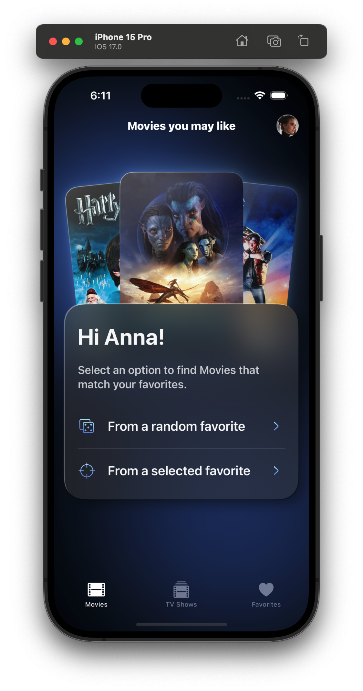
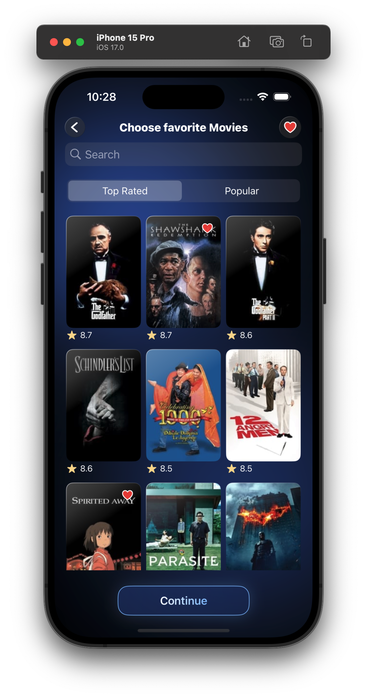
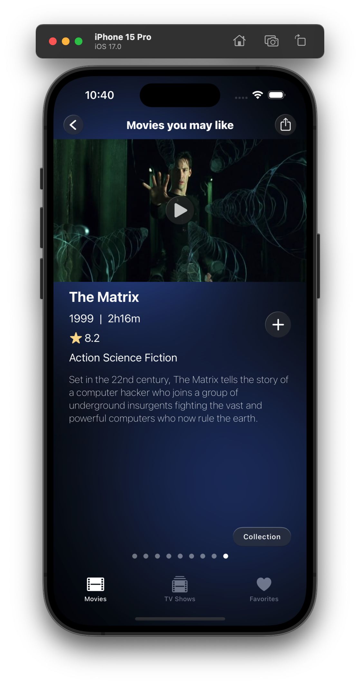
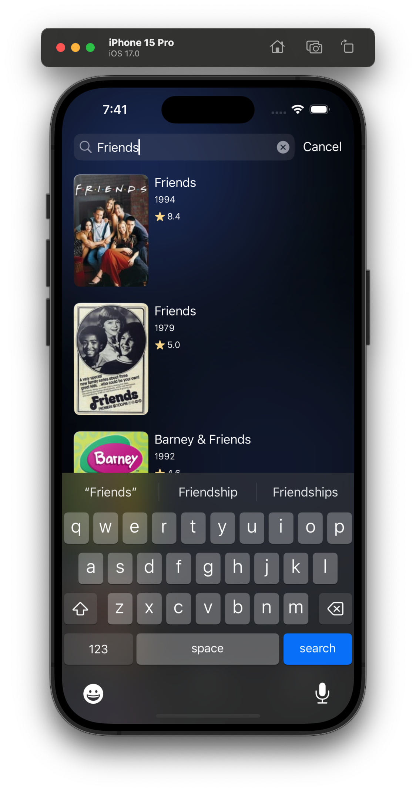
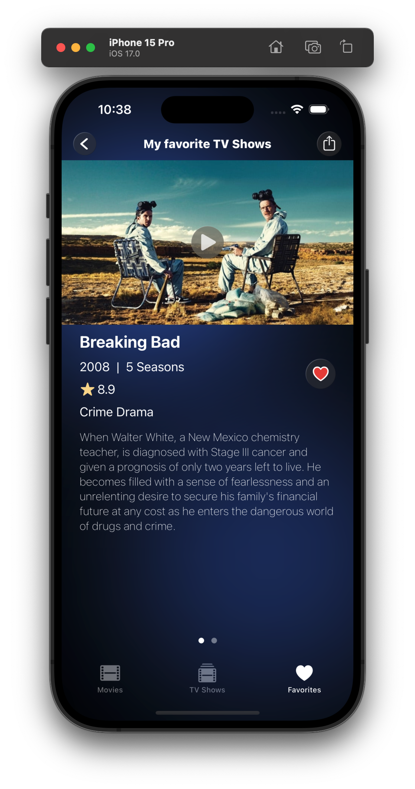

# MoviePal

This app streamlines film discovery. Find new favorites quickly without endless scrolling. A user-friendly solution for movie enthusiasts.

Work in progress...

 

 

## Requirements

* iOS 16.4+

## Features

* Distinctive self-made design.
* Compatibility across various iPhones.
* SwiftUI advanced animations with custom shapes.
* Diverse custom SwiftUI components and modifiers.
* Integration of UIImagePickerController for photo capture.
* Seamless API calls enabled by Concurrency and a touch of Combine.
* Customizable Picker size utilizing UISegmentedControl.
* Personalization options with user names and profile pictures.
* Tailored list layout, sections, and section headers.
* Custom Confirmation and Alert views.

## Technologies Used
* Design Tools: Figma, Illustrator, and SVG to SwiftUI Converter.
* UX/UI: SwiftUI, Lottie, and occasionally UIKit as needed.
* Asynchronous Operations: Concurrency and Combine.
* Persistent Storage: Core Data, UserDefaults, FileManager and Keychain.
* Analytics: Firebase for Analytics and Crashlytics to track stability.
* Backend: This app is supported by its own API built with [Vapor](https://github.com/vapor/vapor). It handles user authentication, data retrieval, and will soon integrate third-party APIs.
* Third-party API Integration: [TMDb](https://developer.themoviedb.org/reference/intro/getting-started) and [OpenAI](https://openai.com/product).

## Usage

1. Create a list of your favorite movies/TV shows by selecting from top-rated or popular options or by searching through an autocomplete feature.
2. Discover similar movies/TV shows by selecting favorites or exploring randomly from your collection.
3. Accessing movie collections is as simple as a single click.
4. Share your favorites with your friends and family.

## Dependency

* This application uses the following packages:
    * [Lottie for iOS](https://github.com/airbnb/lottie-ios)
    * [SwiftUI CachedAsyncImage](https://github.com/lorenzofiamingo/swiftui-cached-async-image)
    * [Firebase iOS SDK](https://github.com/firebase/firebase-ios-sdk)

## Architecture

* Clean Architecture + MVVM-C.

## License

All rights reserved.